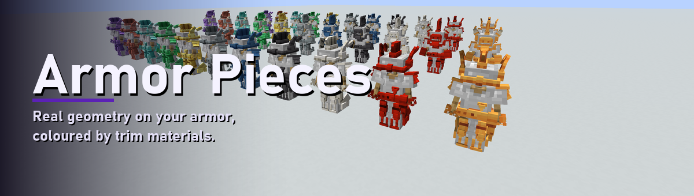
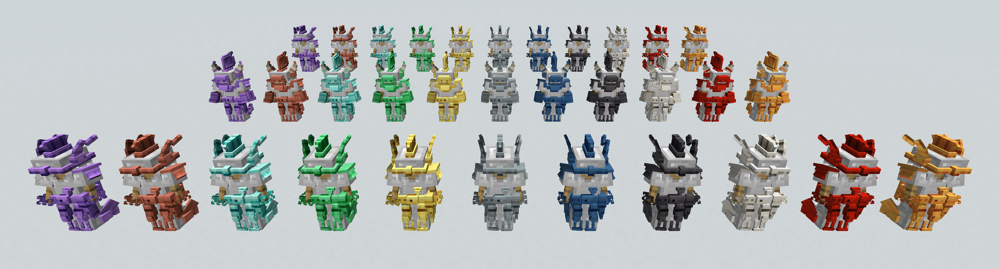
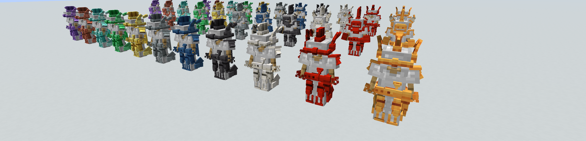
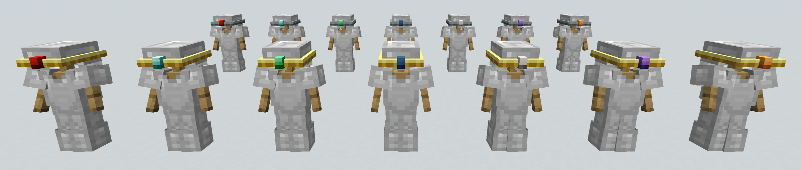
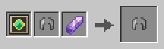
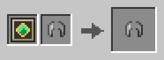
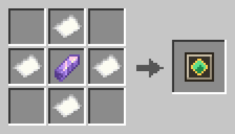
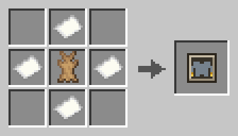

<!-- Generated by modpage from modpage.yml -- edit that file, not this one. -->

  

<i>Decorative parts for armor — applied at a smithing table like trims, coloured by the same trim materials.</i>

  
  
  
  

<b>Loaders:</b> Fabric &nbsp;•&nbsp; <b>Minecraft:</b> 26.2 &nbsp;•&nbsp; <b>Side:</b> Client & Server

<a href="https://github.com/mattjesmc/ArmorPieces">GitHub</a> &nbsp;•&nbsp; <a href="https://github.com/mattjesmc/ArmorPieces/issues">Issues</a> &nbsp;•&nbsp; <a href="https://github.com/mattjesmc/ArmorPieces/blob/main/CHANGELOG.md">Changelog</a>

---

## About

A vanilla trim is paint on the armor's texture, so it never sticks out. Armor Pieces adds
**parts**: real geometry hung on the body. A plume on the helmet, spaulders on the shoulders, a
sash on the belt, spurs on the heels.

A part is applied at a smithing table the way a trim is, with a template and a trim material, and
takes that material's colour. Trim and parts live on the same piece of armor; neither replaces the
other.

Some parts take a second material through a **fitting**: a gem set into the circlet, a metal
buckle and a dyed strap on the sash, a dyed inlay on the greaves, a banner's design on the back banner. One more smithing
step, and the item decides where it goes.

Twenty parts ship across twelve sockets. Each is a datapack entry, a model and a texture, no
code, and a pack can add its own the same way.

---

## Features

- **Twelve sockets, one part at a time** — `crest`, `brow`, `horns`, `pauldrons`, `back`, `collar`, `vambraces`, `belt`, `tassets`, `knees`, `spurs`, `greaves`. A socket holds one part, so a new crest replaces the crest — but the twenty parts are spread unevenly over the twelve, three of them on `back` alone. Seven of the sockets are mirrored pairs, so spaulders means both shoulders.
- **Coloured by vanilla trim materials** — One grayscale master per part is mapped onto each material's own palette at load time. A new trim material costs a part no new art at all.
- **Fittings** — A part can declare places for a second material — `gemstone`, `guard`, `inlay`, `banner` — and the fitting template sets one: gems and metals by trim material, inlays by dye, banners from a banner made at a loom. The template alone takes them out again. Fittings are data too, and an effect can be gated on one.
- **One smithing recipe per socket, forever** — The part rides on the template item as a component, so a pack hands out a template and needs no recipe of its own.
- **Optional behaviour** — A part may carry effects — attributes, mob effects, a projectile dodge, gliding — configured in the same JSON file. `pinions` is a cut-down elytra that actually flies.
- **A Blockbench plugin for making parts** — Opens a part on the vanilla player wearing real armor, walk cycle and all. Master, static layer and fitting masks are painted in place, any trim material previews live with its fittings filled or empty, the name, sockets, fittings and effects are a dialog, and Save writes every file the pack needs.

---

## Gallery

  
   <i>Every socket filled — three sets, one per row, in all eleven trim materials</i>

  
   <i>The front row up close; the horns keep their ivory through every material</i>

  
   <i>The same three rows from behind — wing roots, banner and pinions on the back socket</i>

  
   <i>One circlet, seven gems — the fitting takes a second material</i>

---

## Recipes

<b>Every recipe in the mod</b>

<table>
<tr>
<td align="center" width="33%"> Apply Back <i>(Smithing Decoration)</i></td>
<td align="center" width="33%"> Apply Belt <i>(Smithing Decoration)</i></td>
<td align="center" width="33%"> Apply Brow <i>(Smithing Decoration)</i></td>
</tr>
<tr>
<td align="center" width="33%"> Apply Collar <i>(Smithing Decoration)</i></td>
<td align="center" width="33%"> Apply Crest <i>(Smithing Decoration)</i></td>
<td align="center" width="33%"> Apply Fitting <i>(Smithing Fitting)</i></td>
</tr>
<tr>
<td align="center" width="33%"> Apply Greaves <i>(Smithing Decoration)</i></td>
<td align="center" width="33%"> Apply Horns <i>(Smithing Decoration)</i></td>
<td align="center" width="33%"> Apply Knees <i>(Smithing Decoration)</i></td>
</tr>
<tr>
<td align="center" width="33%"> Apply Pauldrons <i>(Smithing Decoration)</i></td>
<td align="center" width="33%"> Apply Spurs <i>(Smithing Decoration)</i></td>
<td align="center" width="33%"> Apply Tassets <i>(Smithing Decoration)</i></td>
</tr>
<tr>
<td align="center" width="33%"> Apply Vambraces <i>(Smithing Decoration)</i></td>
<td align="center" width="33%"> Clear Fitting <i>(Smithing Fitting)</i></td>
<td align="center" width="33%"> Template Banner</td>
</tr>
<tr>
<td align="center" width="33%"> Template Brooch</td>
<td align="center" width="33%"> Template Brush Crest</td>
<td align="center" width="33%"> Template Circlet</td>
</tr>
<tr>
<td align="center" width="33%"> Template Feathering</td>
<td align="center" width="33%"> Template Fitting</td>
<td align="center" width="33%"> Template Gorget</td>
</tr>
<tr>
<td align="center" width="33%"> Template Greaves</td>
<td align="center" width="33%"> Template Heel Wings</td>
<td align="center" width="33%"> Template Helm Wings</td>
</tr>
<tr>
<td align="center" width="33%"> Template Horns</td>
<td align="center" width="33%"> Template Mittens</td>
<td align="center" width="33%"> Template Pinions</td>
</tr>
<tr>
<td align="center" width="33%"> Template Poleyns</td>
<td align="center" width="33%"> Template Sash</td>
<td align="center" width="33%"> Template Spaulders</td>
</tr>
<tr>
<td align="center" width="33%"> Template Spurs</td>
<td align="center" width="33%"> Template Tassets</td>
<td align="center" width="33%"> Template Vambraces</td>
</tr>
<tr>
<td align="center" width="33%"> Template Visor</td>
<td align="center" width="33%"> Template Wing Roots</td>
</tr>
</table>

---

## Dependencies

**Required**

| Mod | Version | Notes |
| --- | --- | --- |
| [Fabric API](https://modrinth.com/mod/fabric-api) | — | Dynamic registries, resource reload, render layers |

---

## Incompatibilities

**None known.** No conflicts have been reported.

---

## Installation

1. Install [Fabric Loader](https://fabricmc.net/use/) 0.19.3+ on Minecraft 26.2 (Java 25).
2. Drop this mod and Fabric API into `mods/`.
3. Install it on both sides — the client draws the parts, the server owns their behaviour.

---

## Adding a part

A part is two files and a PNG, plus a line in your language file for the name — none of it
code, and any namespace will do. Two ways to make them:

- **In Blockbench**, with the [Armor Pieces plugin](https://github.com/mattjesmc/ArmorPieces/blob/main/tools/blockbench_plugin/armorpieces.js). It opens a part on the vanilla
  player wearing real armor, paints the textures in place, previews any trim material, and
  writes every file on Save.
- **By hand**, writing the datapack entry, the geometry and the grayscale master yourself.

The [authoring guide](https://github.com/mattjesmc/ArmorPieces/blob/main/docs/authoring.md) covers both, along with fittings, handing a part out, and giving
it behaviour — attributes, mob effects, a dodge, gliding — from the same JSON file.

---

## Working on it

`./gradlew build`, `./gradlew runClient`, `./gradlew runServer`.

| Where | What |
| --- | --- |
| `decoration/` | anchors, the datapack registry entry, the item component, the effect hooks |
| `client/` | the render layer, the geometry loader and bake cache, the per-material palette |
| `recipe/`, `item/`, `registry/`, `command/` | smithing, the twelve templates, the creative tab, `/armorpieces stage` |
| `tools/` | Blockbench rigs (`bb_rig.py`, with the vanilla figure and walk cycle from `mc_humanoid.py`), `.bbmodel` ↔ geometry (`bb_geo.py`), master and mask painting and install (`paint_<part>_master.py`, `fitting_mask.py`, `sync_decoration_masters.py`), a material and fitting preview outside the game (`preview_material.py`), template icons, `trace_geometry.py` for measuring a part against the body |
| `tools/blockbench_plugin/` | the Blockbench plugin — see the [authoring guide](https://github.com/mattjesmc/ArmorPieces/blob/main/docs/authoring.md) |
| `tools/decoration_masters/` | the grayscale masters — the source of truth for every part's art |

The rigs, the `/armorpieces stage` command and the plugin's Save path are described in the
[authoring guide](https://github.com/mattjesmc/ArmorPieces/blob/main/docs/authoring.md); `tools/check_authoring.py` runs the plugin's round trip over every
shipped part.

---

## FAQ

<b>Does a part replace the armor trim?</b>

No. A piece carries its trim and its parts at once.

<b>How do I put a gem in the circlet?</b>

Craft a fitting template, then smithing table: template, the decorated helmet, and the gem. A gem goes to the gemstone, an ingot to the guard, a dye to the inlay and a banner to the banner — the item decides, so one template covers every fitting. Every part on the piece is offered the item, so one gem fills the stone of each part that has one. Template and helmet with the third slot empty takes every fitting out again. Re-applying a part at its own socket template keeps what is set in it, so changing a circlet's metal does not cost the gem.

<b>Can two parts share a socket?</b>

No — applying a new crest replaces the crest. Several parts may be *available* for one socket (`horns` and `helm_wings` both fit `horns`); the choice is the expressive act.

<b>Do I need the mod to add parts?</b>

You need the mod installed, but adding a part takes no Java — a datapack and a resource pack. Only a brand-new *effect* type needs code. The [authoring guide](https://github.com/mattjesmc/ArmorPieces/blob/main/docs/authoring.md) walks through it.

---

## License

Released under a custom license — see
[LICENSE](https://github.com/mattjesmc/ArmorPieces/blob/main/LICENSE).

Use it, play with it, and modify it for yourself: no permission needed, no fee. **Redistribution
needs written permission first.** That covers re-uploading the jar or the pack zips, mirroring
them, and bundling the mod in a modpack, server pack or launcher — paid or not — as well as
publishing a fork. Linking to an official download page never needs permission.

Ask on the [issue tracker](https://github.com/mattjesmc/ArmorPieces/issues); permission is given
in writing and covers the distribution it describes.

---

Every part in this mod is the same two files and a PNG a pack of your own would write.
