<!-- Generated by modpage from modpage.yml -- edit that file, not this one. -->

  

<i>Parts, skins and cloth for armor — because someone else at spawn is wearing your diamond set.</i>

  
  
  
  

<b>Loaders:</b> Fabric &nbsp;•&nbsp; <b>Minecraft:</b> 26.2 &nbsp;•&nbsp; <b>Side:</b> Client & Server

<a href="https://github.com/mattjesmc/ArmorPieces">GitHub</a> &nbsp;•&nbsp; <a href="https://github.com/mattjesmc/ArmorPieces/issues">Issues</a> &nbsp;•&nbsp; <a href="https://github.com/mattjesmc/ArmorPieces/blob/main/CHANGELOG.md">Changelog</a>

---

## About

You know the one. You walk into spawn in your best diamond and the first person you see is
wearing the same helmet, the same chestplate, the same Sentry trim in the same netherite. Vanilla
can build 1,568,239,201 armor sets, which sounds like plenty right up until it happens to you
twice in a week.

Armor Pieces takes that number to **3 × 10⁸⁴** — more than thirty thousand unique diamond sets
for every atom in the observable universe. Diamond is one of seven armor materials.

It gives one piece of armor **four layers of decoration, each an independent choice**:
a **part** hung on a socket, a **skin** that changes what the plate itself is made of, a **cloth**
worn over the chest, and vanilla's own **trim** underneath them all. Every one of them is applied
at a smithing table, and none of them replaces another - a helmet can carry a skin, a trim, a
crest, a browband and a pair of horns at once.

**Ninety-one parts, over twelve sockets.** `crest`, `brow`, `horns`, `pauldrons`, `back`,
`collar`, `vambraces`, `belt`, `tassets`, `knees`, `spurs`, `greaves` - a plume on the helmet,
spaulders on the shoulders, a sash on the belt, spurs on the heels. Parts are real geometry hung
on the body, not paint on the texture. A socket holds one part and every socket has at least six
to choose from, so the choice is the expressive act. Each part is applied with a trim material and
takes that material's colour.

**Fourteen armor skins.** A skin is the armor's *own* texture - what the plate is, rather than
what is bolted to it. Plate, gothic, milanese, mail, chainmail, lorica, runic, hoplite, samurai,
gambeson, brigandine, varangian, scale and lamellar. Each is recoloured through the armor
material's own palette, so a skinned iron helmet still reads as iron and a modded armor material
is skinned for free from the texture it already ships. A skin is paid for in the metal the piece
is made of: re-skinning is re-forging.

**Two cloths.** A tunic or a tabard over a chestplate, carrying the design of any banner you make
at a loom - so the heraldry is yours rather than a list the mod maintains. It is baked into the
armor's texture rather than hung off it, so it clips nothing and the plate's own rivets and edges
read through it.

**Fittings.** Some parts have a second colour, set separately: a gem in the circlet, a metal
buckle and a dyed strap on the sash, a dyed inlay on the greaves, a banner on the back banner.
One more smithing step, one template per fitting, and the item decides where it goes.

Most of it is **found rather than made**. Thirty parts have a crafting recipe, the ones where
the item is plainly the part or what it is made of; the rest turn up in the chests that suit them,
each theme in its own kind of structure, with the skins and the fitting templates alongside. An
**advanced smithing table** shows a whole set worn by a stand and takes a part, a fitting, a
trim, a skin or a cloth off again, which the smithing table cannot.

Every part, skin and cloth is a datapack entry, a model and a texture, no code - and a pack adds
its own the same way, from Blockbench, in folders of its own.

---

## New in 0.3.0

The release that turned a set of parts into a wardrobe.

- **Seventy-one new parts — ninety-one in total.** Every one of the twelve sockets now has at
  least six answers, and the six themes reach across the whole suit. Among them a family of
  seven flat **visor styles** on the `brow` socket, whose sights are real openings with your
  own face behind them rather than paint.
- **Armor skins.** A third template family, and the first thing in the mod that changes the
  armor itself instead of adding to it. Fourteen ship, each recoloured through the armor
  material's own vanilla palette, so a skin costs no per-material art and a modded material
  gets one free.
- **Cloth.** A fourth layer: a **Tunic** or a **Tabard** over a chestplate, wearing the design
  of any banner you make at a loom, painted into the armor's texture rather than hung off it.
- **Most parts are now found rather than crafted.** A **loot group** is one file naming a
  category of vanilla tables and a tag of parts found in them; six ship, one per theme —
  knightly gear in strongholds and trial chambers, beast trophies in bastions, court jewellery
  in mansions and ancient cities, tidal parts in shipwrecks and ocean ruins, and so on. Skins
  are divided over the same six, and a fitting template turns up in all of them.
- **The chance belongs to the table, not to the part.** One pool per table, rolled once: a
  chest's odds of holding something of ours stay put however many parts are added. Another part
  changes *which* one you find, never how often.
- **The advanced smithing table.** Crafted from a smithing table, an armor stand and two iron
  ingots. It holds a whole set worn by a stand and lists each piece's sockets and fittings as
  rows of icons, with its trim, its skin and its cloth on a row of its own — and Remove is the
  one way any of them ever comes off.
- **Thirty recipes, not ninety-one.** A template recipe now ships only where the centre
  item is plainly the part or what it is made of — a bell for the bells, a goat horn for the
  horns. The rest are found.
- **One template per fitting.** *Gemstone*, *Guard*, *Inlay* and *Banner*, each with its own
  look, name and recipe, instead of one template that guessed.
- **Any recipe the mod ships can be switched off** by overriding its file with
  `{"type": "armorpieces:disabled"}`.
- **Parts on the first-person hand.** Vanilla shows a bare sleeve there and no armor at all;
  pauldrons and vambraces now ride the hand you actually spend the game looking at.
  `first_person_parts` in `config/armorpieces.json` turns it off — the mod's first setting.
- **Blockbench, for your pack.** The plugin no longer assumes content lives in this repository:
  it opens a part on the vanilla player wearing real armor, paints master, static layer and
  fitting masks in place, previews any trim material live, and on Save writes every file into
  *your* datapack and resource pack — which it makes, finds and zips for you.

---

## Features

- **Twelve sockets, one part at a time** — `crest`, `brow`, `horns`, `pauldrons`, `back`, `collar`, `vambraces`, `belt`, `tassets`, `knees`, `spurs`, `greaves`. A socket holds one part, so a new crest replaces the crest — and with ninety-one parts every socket has at least six to choose from. Seven of the sockets are mirrored pairs, so spaulders means both shoulders.
- **Coloured by vanilla trim materials** — One grayscale master per part is mapped onto each material's own palette at load time. A new trim material costs a part no new art at all.
- **On your own hands, in first person** — Vanilla draws a bare sleeve on the first-person hand and nothing else — not armor, not a trim — so the one view you spend the whole game in is the one that never showed what you were wearing. Pauldrons and vambraces show there now, on the same player model the world sees, swinging with the arm through every animation the hand already has. They are close to the camera and they are meant to be — and there is a setting to turn them off, if you would rather keep the view clear.
- **Fourteen armor skins** — The one thing here that changes the armor itself rather than adding to it — plate, gothic, milanese, mail, chainmail, lorica, runic, hoplite, samurai, gambeson, brigandine, varangian, scale, lamellar. One greyscale master pair on vanilla's own armor grid, recoloured at load through eight shades taken from *that armor material's* vanilla texture, with vanilla's own panel edges and shadows mixed back over it. A skinned iron helmet still reads as iron, gold still reads as gold, and a modded armor material is skinned for free from the texture it already ships. Applied at the advanced smithing table with the piece's own reforging material — re-skinning is re-forging, and it costs the metal the piece is made of.
- **Cloth over the chest** — A **Tunic** or a **Tabard**, applied with a cloth template and a banner, and the design is the banner's — sixteen dyes crossed with every pattern layer, made at a loom, so the heraldry is a player's choice rather than a list the mod keeps. It is painted into the armor's own texture rather than hung off it, so it moves with the armor, clips nothing, and the plate's rivets and edges read *through* it. It sits over the skin, under every part and under the trim. One greyscale cut mask ships the whole feature; there is no per-material art and no per-banner art.
- **Fittings** — A part can declare places for a second material — `gemstone`, `guard`, `inlay`, `banner` — and a fitting template sets one: gems and metals by trim material, inlays by dye, banners from a banner made at a loom. There is a template per fitting, each with its own look and recipe, and the template with the third slot empty takes its fitting out again. Fittings are data too — a pack's new fitting gets its template from a recipe — and an effect can be gated on one.
- **Found in the world** — Most parts are found rather than crafted, each theme in the structures that suit it — knightly gear in strongholds and trial chambers, beast trophies in bastions, court jewellery in mansions and ancient cities, tidal parts in shipwrecks and ocean ruins. A **loot group** is one file naming a category of tables and the tag of parts found in them, so a pack adds a whole look to the world at once, or drops one part into one chest from its own data file — the one thing a datapack cannot do for itself, since it can only replace a vanilla table whole. Armor **skins** are found the same way, divided over the same groups, and a **fitting template** turns up in every one of them. The odds belong to the table, so a chest's chance of holding something stays put however many parts are added. A loot function puts a part on a piece of armor a table drops, gem and all.
- **Taking parts off** — The advanced smithing table, crafted from a smithing table, an armor stand and two iron ingots, holds a whole set worn by a stand at once and lists each piece's sockets and their fittings as rows of icons, with the piece's own row under them — its trim, its skin and, on a chestplate, its cloth. Pick one and Remove empties it — the one way a part, a fitting, a trim, a skin or a cloth ever comes off. An empty place shows a hint of the template that would fill it. Its own template and material slots run the smithing table's recipes, with the result on the stand before it is paid for, and a fitting goes into the socket that is picked rather than into every part that takes one.
- **One smithing recipe per socket, forever** — The part rides on the template item as a component, so a pack hands out a template and needs no recipe of its own. And any recipe the mod ships can be switched off by overriding its file with `{"type": "armorpieces:disabled"}` — a part that is found rather than made, a server without fittings.
- **Optional behaviour** — A part may carry effects — attributes, mob effects, a projectile dodge, gliding — configured in the same JSON file. `pinions` is a cut-down elytra that actually flies.
- **A Blockbench plugin for making parts** — Opens a part on the vanilla player wearing real armor, walk cycle and all. Master, static layer and fitting masks are painted in place, any trim material previews live with its fittings filled or empty, the name, sockets, fittings, effects and loot are a dialog, and Save writes every file the pack needs — into your own datapack and resource pack, which it makes, finds and zips for you.

---

## Gallery

  
   <i>The six themed sets, every socket filled — knightly, court, beast, wayfarer, tidal, carapace</i>

  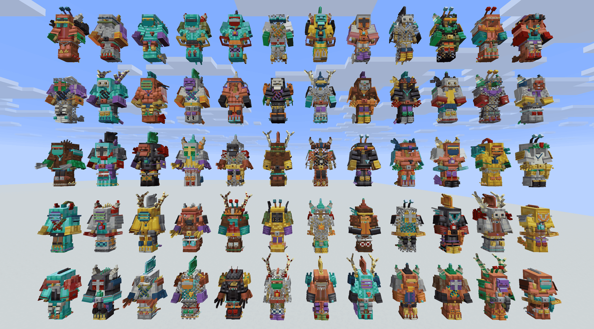
   <i>Sixty sets with nothing about them chosen — armor, skin, cloth, part, material and every fitting rolled</i>

  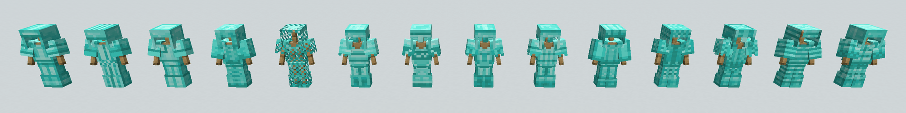
   <i>Fourteen armor skins on one diamond suit — the plate itself changed, not something hung on it</i>

  
   <i>One circlet, seven gems — the fitting takes a second material</i>

  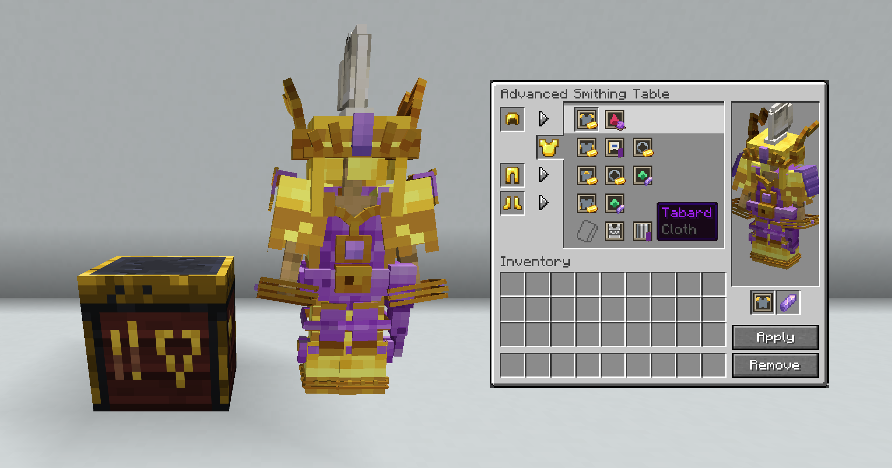
   <i>The advanced smithing table, holding the whole court suit beside it — the chestplate's sockets and their fittings as rows of icons, its own trim, skin and cloth under them, and Remove, the one way any of it comes off again</i>

---

## How many sets is that?

A diamond set in vanilla is one look plus a trim. Eighteen patterns times eleven materials,
plus untrimmed, is **199** states per piece — and **1,568,239,201** for a set of four.

Now count that same diamond set with this mod installed. Each piece keeps all 199 of its trims
and gains a skin
(fourteen, or bare), a part in each of its sockets, each part in one of eleven materials, each
part's fittings filled or left empty — a gem from seven, a metal from four, an inlay from
sixteen dyes — and the chestplate a tunic or a tabard on top.

| | Vanilla diamond | With Armor Pieces |
| --- | ---: | ---: |
| Helmet | 199 | 1,833,029,934,300 |
| Chestplate | 199 | 5,113,599,898,358,700 |
| Leggings | 199 | 1,839,405,834,600 |
| Boots | 199 | 1,187,185,245 |
| **Full set** | **1,568,239,201** | **20,468,798,559,625,822,847,874,604,407,037,697,665,836,570,000,000** |

That is **2 × 10⁴⁹** — about 10⁴⁰ times the whole of vanilla, and roughly a sixth of the atoms
in the Earth. Some smaller ways to hold it:

- **The boots alone** come to 1,187,185,245 arrangements: three quarters of every trimmed
  diamond set vanilla can build, on your feet.
- **The helmet alone** is 1,169 times vanilla's entire four-piece space.
- **Shape alone**, before a single colour is chosen — which part sits in which socket, and
  nothing else — is 368,709,304,320 distinct silhouettes. 235 times vanilla's fully trimmed
  space, in pure geometry.
- Pick a set a second and you exhaust vanilla in fifty years. You exhaust this one in
  4.7 × 10³¹ times the age of the universe.

And all of that **counts a banner as a single design**, which it is not. A banner is sixteen
base colours and up to six layers of forty-two patterns in sixteen dyes:
**1,475,646,641,940,097,552** banners, any of which can go on the back banner, the cloak, the
tunic or the tabard. Count them properly and the chestplate alone reaches 7.7 × 10⁵⁰, and a
full set:

**3.07 × 10⁸⁴** — over thirty thousand distinct diamond sets for every atom in the observable
universe. (There are about 7.3 × 10⁷⁹ of those, if you take Planck's numbers and the baryons
they imply.)

And every number on this page is **diamond alone**, because that is what vanilla is being
compared against. Diamond is one of seven armor materials, six of which take a skin — which
multiplies the whole table by about thirteen hundred again, before leather has been dyed.

Nobody at spawn is wearing yours.

---

## Recipes

<b>Every recipe in the mod</b>

<table>
<tr>
<td align="center" width="33%">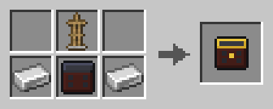 Advanced Smithing Table</td>
<td align="center" width="33%"> Apply Back <i>(Smithing Decoration)</i></td>
<td align="center" width="33%"> Apply Belt <i>(Smithing Decoration)</i></td>
</tr>
<tr>
<td align="center" width="33%"> Apply Brow <i>(Smithing Decoration)</i></td>
<td align="center" width="33%">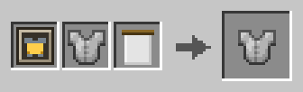 Apply Cloth <i>(Smithing Cloth)</i></td>
<td align="center" width="33%"> Apply Collar <i>(Smithing Decoration)</i></td>
</tr>
<tr>
<td align="center" width="33%"> Apply Crest <i>(Smithing Decoration)</i></td>
<td align="center" width="33%"> Apply Fitting <i>(Smithing Fitting)</i></td>
<td align="center" width="33%"> Apply Greaves <i>(Smithing Decoration)</i></td>
</tr>
<tr>
<td align="center" width="33%"> Apply Horns <i>(Smithing Decoration)</i></td>
<td align="center" width="33%"> Apply Knees <i>(Smithing Decoration)</i></td>
<td align="center" width="33%"> Apply Pauldrons <i>(Smithing Decoration)</i></td>
</tr>
<tr>
<td align="center" width="33%">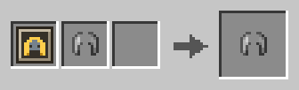 Apply Skin <i>(Smithing Skin)</i></td>
<td align="center" width="33%"> Apply Spurs <i>(Smithing Decoration)</i></td>
<td align="center" width="33%"> Apply Tassets <i>(Smithing Decoration)</i></td>
</tr>
<tr>
<td align="center" width="33%"> Apply Vambraces <i>(Smithing Decoration)</i></td>
<td align="center" width="33%">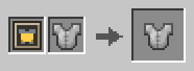 Clear Cloth <i>(Smithing Cloth)</i></td>
<td align="center" width="33%"> Clear Fitting <i>(Smithing Fitting)</i></td>
</tr>
<tr>
<td align="center" width="33%">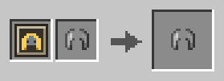 Clear Skin <i>(Smithing Skin)</i></td>
<td align="center" width="33%"> Cloth Template Tabard</td>
<td align="center" width="33%">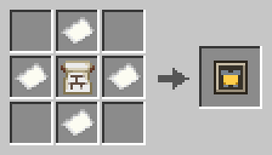 Cloth Template Tunic</td>
</tr>
<tr>
<td align="center" width="33%">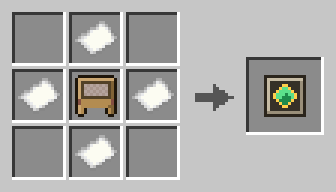 Fitting Template Banner</td>
<td align="center" width="33%">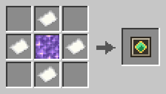 Fitting Template Gemstone</td>
<td align="center" width="33%">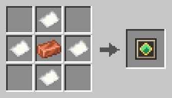 Fitting Template Guard</td>
</tr>
<tr>
<td align="center" width="33%">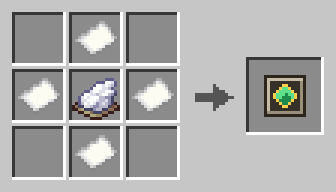 Fitting Template Inlay</td>
<td align="center" width="33%"> Skin Template Brigandine</td>
<td align="center" width="33%"> Skin Template Chainmail</td>
</tr>
<tr>
<td align="center" width="33%">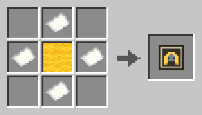 Skin Template Gambeson</td>
<td align="center" width="33%">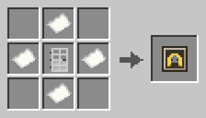 Skin Template Gothic</td>
<td align="center" width="33%">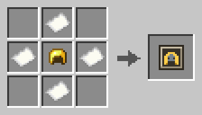 Skin Template Hoplite</td>
</tr>
<tr>
<td align="center" width="33%">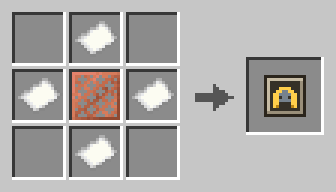 Skin Template Lamellar</td>
<td align="center" width="33%"> Skin Template Lorica</td>
<td align="center" width="33%">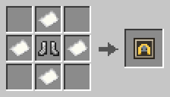 Skin Template Mail</td>
</tr>
<tr>
<td align="center" width="33%">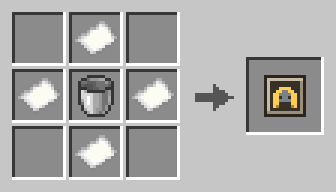 Skin Template Milanese</td>
<td align="center" width="33%">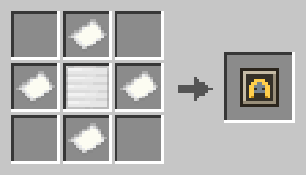 Skin Template Plate</td>
<td align="center" width="33%">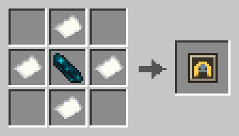 Skin Template Runic</td>
</tr>
<tr>
<td align="center" width="33%">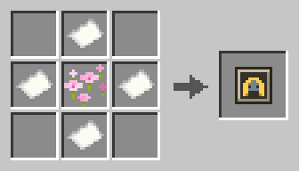 Skin Template Samurai</td>
<td align="center" width="33%">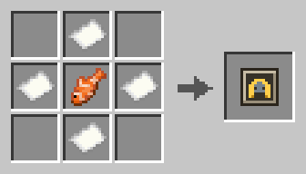 Skin Template Scale</td>
<td align="center" width="33%">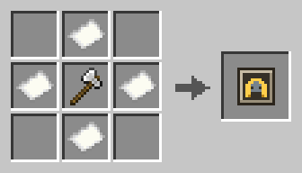 Skin Template Varangian</td>
</tr>
<tr>
<td align="center" width="33%">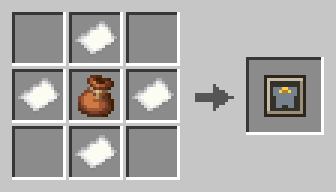 Template Bandolier</td>
<td align="center" width="33%"> Template Banner</td>
<td align="center" width="33%">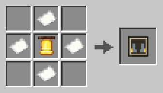 Template Bells</td>
</tr>
<tr>
<td align="center" width="33%"> Template Brush Crest</td>
<td align="center" width="33%">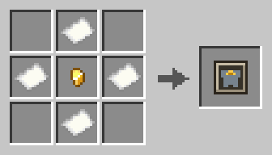 Template Chain Of Office</td>
<td align="center" width="33%"> Template Circlet</td>
</tr>
<tr>
<td align="center" width="33%">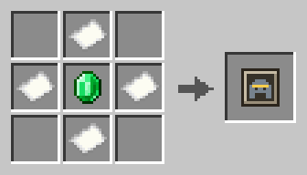 Template Coronet</td>
<td align="center" width="33%"> Template Feathering</td>
<td align="center" width="33%">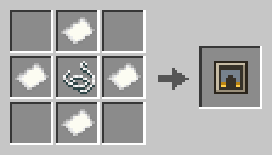 Template Garters</td>
</tr>
<tr>
<td align="center" width="33%"> Template Gorget</td>
<td align="center" width="33%">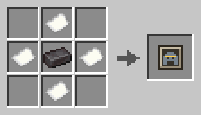 Template Great Helm</td>
<td align="center" width="33%"> Template Greaves</td>
</tr>
<tr>
<td align="center" width="33%"> Template Horns</td>
<td align="center" width="33%">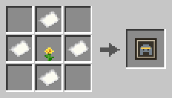 Template Laurel</td>
<td align="center" width="33%"> Template Mittens</td>
</tr>
<tr>
<td align="center" width="33%">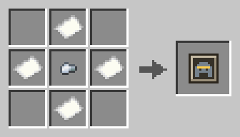 Template Nasal</td>
<td align="center" width="33%">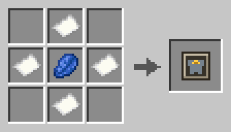 Template Pendant</td>
<td align="center" width="33%"> Template Pinions</td>
</tr>
<tr>
<td align="center" width="33%"> Template Poleyns</td>
<td align="center" width="33%">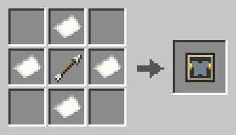 Template Quiver</td>
<td align="center" width="33%"> Template Sash</td>
</tr>
<tr>
<td align="center" width="33%"> Template Spaulders</td>
<td align="center" width="33%">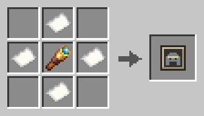 Template Spectacle Visor</td>
<td align="center" width="33%">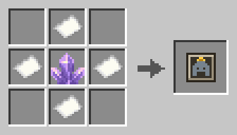 Template Spire</td>
</tr>
<tr>
<td align="center" width="33%"> Template Spurs</td>
<td align="center" width="33%"> Template Tassets</td>
<td align="center" width="33%">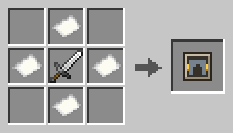 Template Thigh Sheath</td>
</tr>
<tr>
<td align="center" width="33%"> Template Visor</td>
<td align="center" width="33%">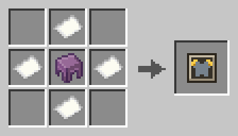 Template Wing Cases</td>
<td align="center" width="33%"> Template Wing Roots</td>
</tr>
</table>

---

## Dependencies

**Required**

| Mod | Version | Notes |
| --- | --- | --- |
| [Fabric API](https://modrinth.com/mod/fabric-api) | — | Dynamic registries, resource reload, render layers |

---

## Incompatibilities

**None known.** No conflicts have been reported.

---

## Installation

1. Install [Fabric Loader](https://fabricmc.net/use/) 0.19.3+ on Minecraft 26.2 (Java 25).
2. Drop this mod and Fabric API into `mods/`.
3. Install it on both sides — the client draws the parts, the server owns their behaviour.

---

## Adding a part

A part is two files and a PNG, plus a line in your language file for the name — none of it
code, and any namespace will do. Two ways to make them:

- **In Blockbench**, with the [Armor Pieces plugin](https://github.com/mattjesmc/ArmorPieces/blob/main/tools/blockbench_plugin/armorpieces.js). It opens a part on the vanilla
  player wearing real armor, paints the textures in place, previews any trim material, and
  writes every file on Save.
- **By hand**, writing the datapack entry, the geometry and the grayscale master yourself.

The [authoring guide](https://github.com/mattjesmc/ArmorPieces/blob/main/docs/authoring.md) covers both, along with fittings, handing a part out, and giving
it behaviour — attributes, mob effects, a dodge, gliding — from the same JSON file.

---

## Working on it

`./gradlew build`, `./gradlew runClient`, `./gradlew runServer`.

| Where | What |
| --- | --- |
| `decoration/` | anchors, the datapack registry entry, the item component, the effect hooks |
| `client/` | the render layer, the geometry loader and bake cache, the per-material palette, the skin and cloth bakes, the advanced table's screen |
| `skin/`, `cloth/` | the datapack registries behind an armor skin and a cloth, and the components a piece carries them in |
| `recipe/`, `item/`, `registry/`, `command/` | smithing, the twelve socket templates and the fitting, skin and cloth templates, the creative tab, `/armorpieces stage` |
| `loot/`, `block/`, `menu/` | parts in loot tables and the `set_decoration` function; the advanced smithing table and its menu |
| `tools/` | Blockbench rigs (`bb_rig.py`, with the vanilla figure and walk cycle from `mc_humanoid.py`), `.bbmodel` ↔ geometry (`bb_geo.py`), master and mask painting and install (`paint_<part>_master.py`, `fitting_mask.py`, `sync_decoration_masters.py`), a material and fitting preview outside the game (`preview_material.py`), template and recipe icons, `export_pack.py` for zipping a pack, `trace_geometry.py` for measuring a part against the body, the skin masters and their bake, check and install (`skin_sheets.py`, `bake_skin.py`, `check_skin.py`, `sync_skin_masters.py`), and the checks a shipped part and skin pass (`check_part.py`, `check_authoring.py`) |
| `tools/blockbench_plugin/` | the Blockbench plugin — see the [authoring guide](https://github.com/mattjesmc/ArmorPieces/blob/main/docs/authoring.md) |
| `tools/decoration_masters/` | the grayscale masters — the source of truth for every part's art |

The rigs, the `/armorpieces stage` command and the plugin's Save path are described in the
[authoring guide](https://github.com/mattjesmc/ArmorPieces/blob/main/docs/authoring.md); `tools/check_authoring.py` runs the plugin's round trip over every
shipped part.

---

## Configuration

One file, written for you on first launch: `config/armorpieces.json`. It is read on the client
and by the client alone — every setting in it moves pixels and nothing else, so it never has to
match the server's.

| Key | Default | What it does |
| --- | --- | --- |
| `first_person_parts` | `true` | Draws the parts on your arms — pauldrons and vambraces — on the first-person hand as well as on your body. Vanilla shows a bare sleeve there and no armor at all. They sit close to the camera; `false` keeps the view clear. |

A change takes effect on the next launch. A key you leave out takes its default and is written
back, so a setting added by a later version turns up in the file you already have — and a file
that does not parse is left alone and the defaults used, so a typo costs a log line and nothing
else.

---

## FAQ

<b>Does a part replace the armor trim?</b>

No. A piece carries its trim and its parts at once.

<b>How do I put a gem in the circlet?</b>

Craft a gemstone fitting template (an amethyst block in a ring of paper), then smithing table: template, the decorated helmet, and the gem. Every part on the piece is offered the item, so one gem fills the stone of each part that has one — or of the one socket picked, at the advanced smithing table. The same template with the third slot empty takes the gem out again. A guard template does the same for metals, an inlay template for dyes, a banner template for banners. Re-applying a part at its own socket template keeps what is set in it, so changing a circlet's metal does not cost the gem.

<b>How do I take a part off?</b>

At the advanced smithing table. Put the piece in one of its four slots, pick the socket's row and click Remove. What was in the part's fittings goes with it. Picking one of the fitting icons beside the part takes just that fitting out, and the piece's own row under the sockets holds its trim, its skin and — on a chestplate — its cloth, each taken off the same way.

<b>Can two parts share a socket?</b>

No — applying a new crest replaces the crest. Several parts may be *available* for one socket (`horns` and `helm_wings` both fit `horns`); the choice is the expressive act.

<b>The parts on my hands are in the way. Can I turn them off?</b>

Yes. Set `"first_person_parts": false` in `config/armorpieces.json` and restart the game — the file writes itself on first launch. Only the first-person hand is affected; your parts are still on your body, and still on everyone else's. It is the mod's only setting, and deliberately so: everything else about a part is pack data rather than a preference, and nothing in that file changes what an item *does*, so it never has to match the server's.

<b>Do I need the mod to add parts?</b>

You need the mod installed, but adding a part takes no Java — a datapack and a resource pack. Only a brand-new *effect* type needs code. The [authoring guide](https://github.com/mattjesmc/ArmorPieces/blob/main/docs/authoring.md) walks through it.

---

## Bugs and issues

Something broken, something clipping, a part that sits wrong on a body it should fit — the
[issue tracker](https://github.com/mattjesmc/ArmorPieces/issues) is the place for it. So is a
request: a socket, a part, a skin or a fitting that is not there yet.

No GitHub account, and would rather not make one? The comment section on the CurseForge or
Modrinth page reaches me just as well.

For a bug, the three things that make it fixable are your Minecraft and mod versions, the
other mods you are running, and `logs/latest.log` from the run it happened in. A screenshot
settles most questions about how something *looks* on its own.

---

## License

Released under a custom license — see
[LICENSE](https://github.com/mattjesmc/ArmorPieces/blob/main/LICENSE).

Use it, play with it, and modify it for yourself: no permission needed, no fee. **Redistribution
needs written permission first.** That covers re-uploading the jar or the pack zips, mirroring
them, and bundling the mod in a modpack, server pack or launcher — paid or not — as well as
publishing a fork. Linking to an official download page never needs permission.

Ask on the [issue tracker](https://github.com/mattjesmc/ArmorPieces/issues); permission is given
in writing and covers the distribution it describes.

---

Every part in this mod is the same two files and a PNG a pack of your own would write.
