<!-- Generated by modpage from modpage.yml -- edit that file, not this one. -->

<h1 align="center">Armor Pieces</h1>

<p align="center"><i>Decorative parts for armor — applied at a smithing table like trims, coloured by the same trim materials.</i></p>

<p align="center">
  <a href="https://github.com/mattjesmc/ArmorPieces/releases/latest"></a>
  
  
  <a href="https://github.com/mattjesmc/ArmorPieces/blob/main/LICENSE"></a>
</p>

<p align="center">
<b>Loaders:</b> Fabric &nbsp;•&nbsp; <b>Minecraft:</b> 26.2 &nbsp;•&nbsp; <b>Side:</b> Client & Server
</p>

<p align="center">
<a href="https://github.com/mattjesmc/ArmorPieces">GitHub</a> &nbsp;•&nbsp; <a href="https://github.com/mattjesmc/ArmorPieces/issues">Issues</a></p>

---

## About

Vanilla trims are *paint*: a texture layer drawn onto the armor model, which is why no trim ever
sticks out from the armor. Armor Pieces adds the other half — **parts**, real geometry hung on the
body. A plume on the helmet, spaulders on the shoulders, a sash on the belt, spurs on the heels.

Parts are applied at a smithing table exactly the way trims are, and coloured by the same vanilla
trim materials. A piece carries its trim and its parts at once; neither erases the other.

Nineteen parts ship across twelve sockets. Every one of them is data — a datapack and a resource
pack, no Java — and so is every part you add.

---

## Features

- **Twelve sockets, one part each** — `crest`, `brow`, `horns`, `pauldrons`, `back`, `collar`, `vambraces`, `belt`, `tassets`, `knees`, `spurs`, `greaves`. A mirrored pair is one socket, so spaulders means both shoulders.
- **Coloured by vanilla trim materials** — One grayscale master per part is mapped onto each material's own palette at load time. A new trim material costs a part no new art at all.
- **One smithing recipe per socket, forever** — The part rides on the template item as a component, so a pack hands out a template and needs no recipe of its own.
- **Optional behaviour** — A part may carry effects — attributes, mob effects, a projectile dodge, gliding — configured in the same JSON file. `pinions` is a cut-down elytra that actually flies.
- **/armorpieces stage** — Places a grid of armor stands wearing every part in every material, read from the registries, so a datapack's parts show up on it too.

---

## Gallery

<p align="center">
  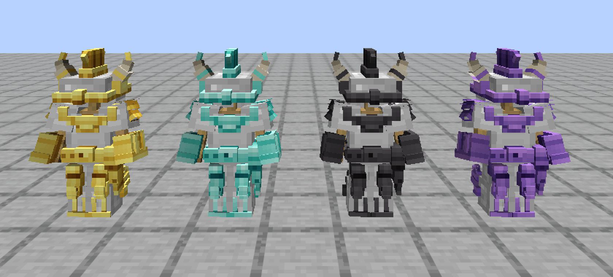
  <br><sub><i>Every socket filled, on iron armor — gold, diamond, netherite, amethyst</i></sub>
</p>

<p align="center">
  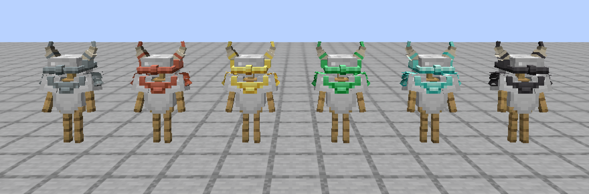
  <br><sub><i>The same parts in six trim materials; the horns keep their ivory through all of them</i></sub>
</p>

<p align="center">
  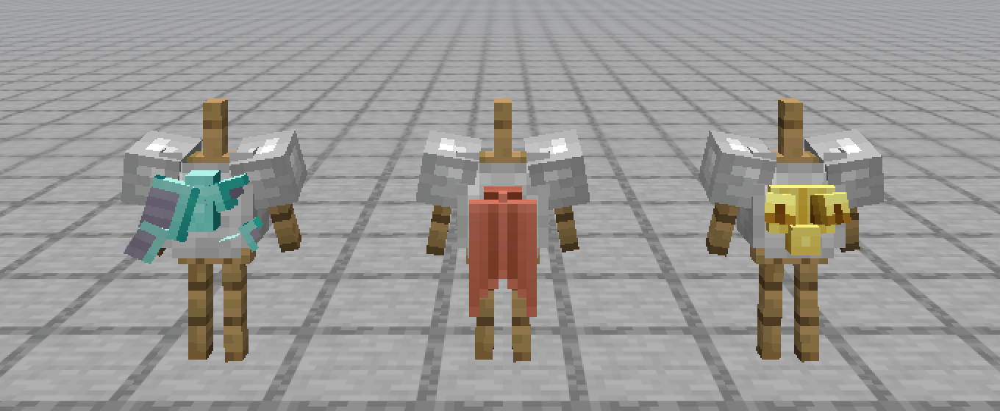
  <br><sub><i>The back socket — pinions, banner, wing roots</i></sub>
</p>

---

## Recipes

<details>
<summary><b>Every recipe in the mod</b></summary>

<table>
<tr>
<td align="center" width="33%"><br><sub>Apply Back <i>(Smithing Decoration)</i></sub></td>
<td align="center" width="33%">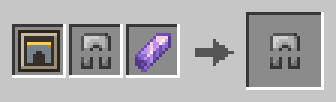<br><sub>Apply Belt <i>(Smithing Decoration)</i></sub></td>
<td align="center" width="33%">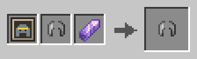<br><sub>Apply Brow <i>(Smithing Decoration)</i></sub></td>
</tr>
<tr>
<td align="center" width="33%">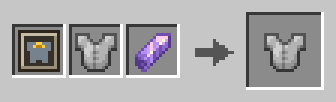<br><sub>Apply Collar <i>(Smithing Decoration)</i></sub></td>
<td align="center" width="33%">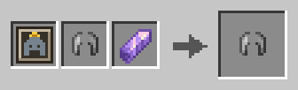<br><sub>Apply Crest <i>(Smithing Decoration)</i></sub></td>
<td align="center" width="33%">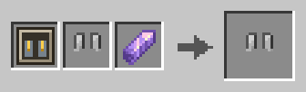<br><sub>Apply Greaves <i>(Smithing Decoration)</i></sub></td>
</tr>
<tr>
<td align="center" width="33%">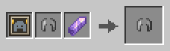<br><sub>Apply Horns <i>(Smithing Decoration)</i></sub></td>
<td align="center" width="33%">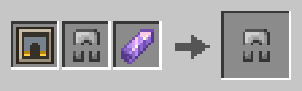<br><sub>Apply Knees <i>(Smithing Decoration)</i></sub></td>
<td align="center" width="33%">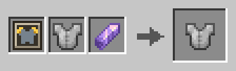<br><sub>Apply Pauldrons <i>(Smithing Decoration)</i></sub></td>
</tr>
<tr>
<td align="center" width="33%"><br><sub>Apply Spurs <i>(Smithing Decoration)</i></sub></td>
<td align="center" width="33%">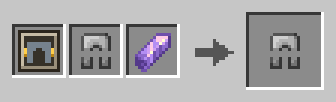<br><sub>Apply Tassets <i>(Smithing Decoration)</i></sub></td>
<td align="center" width="33%">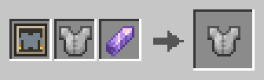<br><sub>Apply Vambraces <i>(Smithing Decoration)</i></sub></td>
</tr>
<tr>
<td align="center" width="33%">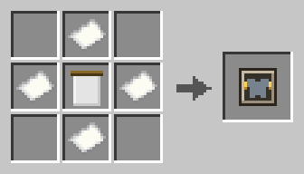<br><sub>Template Banner</sub></td>
<td align="center" width="33%">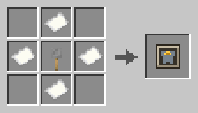<br><sub>Template Brooch</sub></td>
<td align="center" width="33%">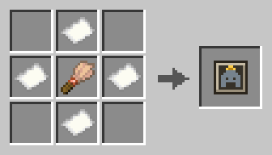<br><sub>Template Brush Crest</sub></td>
</tr>
<tr>
<td align="center" width="33%">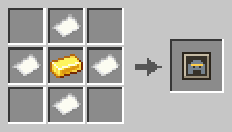<br><sub>Template Circlet</sub></td>
<td align="center" width="33%">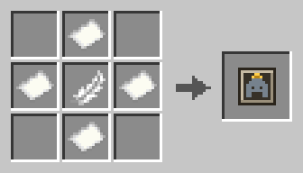<br><sub>Template Feathering</sub></td>
<td align="center" width="33%">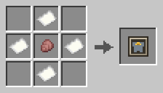<br><sub>Template Gorget</sub></td>
</tr>
<tr>
<td align="center" width="33%">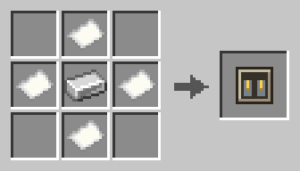<br><sub>Template Greaves</sub></td>
<td align="center" width="33%">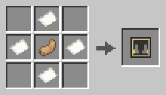<br><sub>Template Heel Wings</sub></td>
<td align="center" width="33%">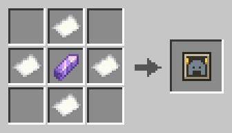<br><sub>Template Helm Wings</sub></td>
</tr>
<tr>
<td align="center" width="33%">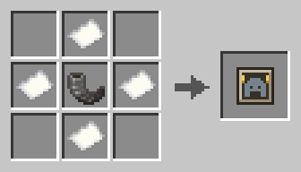<br><sub>Template Horns</sub></td>
<td align="center" width="33%">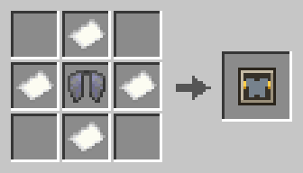<br><sub>Template Pinions</sub></td>
<td align="center" width="33%">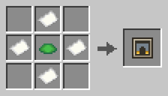<br><sub>Template Poleyns</sub></td>
</tr>
<tr>
<td align="center" width="33%">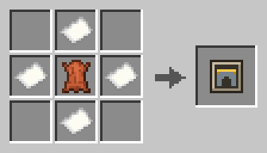<br><sub>Template Sash</sub></td>
<td align="center" width="33%">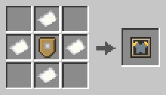<br><sub>Template Spaulders</sub></td>
<td align="center" width="33%">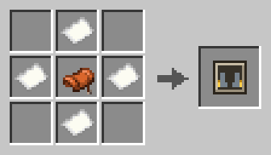<br><sub>Template Spurs</sub></td>
</tr>
<tr>
<td align="center" width="33%">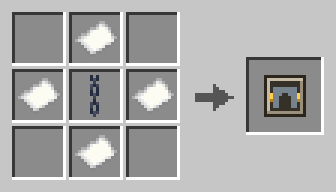<br><sub>Template Tassets</sub></td>
<td align="center" width="33%">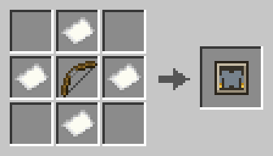<br><sub>Template Vambraces</sub></td>
<td align="center" width="33%">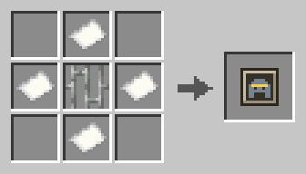<br><sub>Template Visor</sub></td>
</tr>
<tr>
<td align="center" width="33%">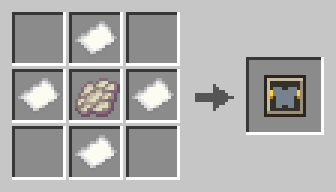<br><sub>Template Wing Roots</sub></td>
</tr>
</table>

</details>

---

## Dependencies

**Required**

| Mod | Version | Notes |
| --- | --- | --- |
| [Fabric API](https://modrinth.com/mod/fabric-api) | — | Dynamic registries, resource reload, render layers |

---

## Incompatibilities

**None known.** No conflicts have been reported.

---

## Installation

1. Install [Fabric Loader](https://fabricmc.net/use/) 0.19.3+ on Minecraft 26.2 (Java 25).
2. Drop this mod and Fabric API into `mods/`.
3. Install it on both sides — the client draws the parts, the server owns their behaviour.

---

## Adding a part

Three files and a PNG, none of them code. Namespace them however you like; every namespace is
scanned.

**1. The part** — `data/<ns>/armorpieces/armor_decoration/dragon_crest.json`

```json
{
  "asset_id": "<ns>:dragon_crest",
  "description": { "translate": "decoration.<ns>.dragon_crest" },
  "anchors": ["crest"]
}
```

`anchors` lists every socket the part may occupy; a smithing attempt anywhere else will not craft.
The sockets are a closed list — they are places on the humanoid model, not data:

| Piece | Anchors |
| --- | --- |
| Helmet | `crest`, `brow`, `horns` |
| Chestplate | `pauldrons`, `back`, `collar`, `vambraces` |
| Leggings | `belt`, `tassets`, `knees` |
| Boots | `spurs`, `greaves` |

**2. The shape** — `assets/<ns>/armorpieces/decoration/dragon_crest.json`

Bones and cubes in Blockbench's vocabulary, baked through vanilla's own `MeshDefinition` path, so
UVs, per-bone pivots and rotations and cube inflation all behave as they do for any entity model.
Coordinates are entity-model units (1/16 block) and **+Y points down**, which is why something
standing on top of a head has a negative Y origin.

```json
{
  "texture_width": 64,
  "texture_height": 32,
  "bones": [
    {
      "name": "spine",
      "pivot": [0, 0, 0],
      "cubes": [ { "origin": [-1, -6, -4], "size": [2, 6, 8], "uv": [0, 0] } ],
      "children": []
    }
  ]
}
```

**3. The texture** — `assets/<ns>/textures/entity/decoration/dragon_crest.png`

One grayscale master: **value is shading, alpha is the silhouette**. The game maps it onto each
trim material's own palette at load time, so every material — including ones a pack adds
tomorrow — is free.

Not everything is metal. An optional RGBA companion named `dragon_crest_static.png` keeps its own
colour instead of taking the material's, so a horn stays ivory and a sash stays cloth while the
hardware still turns gold. The master remains the single source of truth for the silhouette. If a
part needs bespoke art in one material, `dragon_crest_<suffix>.png` beside the master wins.

**4. Handing it out.** There is no recipe to write. The mod ships one smithing recipe per socket
and the part travels on the *template stack*, so a pack only has to give out a template carrying
the `armorpieces:decoration` component:

```json
{
  "type": "minecraft:crafting_shaped",
  "pattern": [" # ", "#F#", " # "],
  "key": { "#": "minecraft:paper", "F": "minecraft:dragon_breath" },
  "result": {
    "id": "armorpieces:crest_template",
    "components": { "armorpieces:decoration": "<ns>:dragon_crest" }
  }
}
```

A loot table with `minecraft:set_components` does the same, and so does nothing at all: the
creative tab is built by walking the registry, so a new part appears there the moment the pack
loads. The twelve template items are `<socket>_template` — `crest_template`, `brow_template`, and
so on.

**Overriding what this mod ships.** Same ids, your pack. A resource pack can restyle any part's
geometry or texture and a datapack can change where it may be worn.

---

## Giving a part behaviour

Parts are cosmetic by default. A part that should do something while it is worn carries `effects`
— one more field on the file you were already writing:

```json
"effects": [
  { "type": "armorpieces:blink", "chance": 0.2, "damage_types": "minecraft:is_projectile" }
]
```

Four built-ins cover every hook from JSON alone:

| `type` | Hooks | Fields |
| --- | --- | --- |
| `armorpieces:attribute` | Attributes | `id`, `attribute`, `amount`, `operation` |
| `armorpieces:mob_effect` | Ticking | `effect`, `amplifier`, `ambient`, `show_particles`, `show_icon` |
| `armorpieces:blink` | Damage | `chance`, `radius`, `damage_types`, `attempts` |
| `armorpieces:glide` | Gliding + Ticking | `sink`, `wear_interval` |

The five hooks are `Ticking` (every server tick worn), `Damage` (a veto — `allowDamage` false
cancels the hit outright), `Attributes` (equip/unequip), `Gliding` (vanilla's own `canGlide`
check) and `Lifecycle`. A part has no durability of its own, so an effect that costs something
spends the *decorated piece's* durability — `pinions` wears the chestplate it is bolted to.

**A new effect type is the one thing that needs Java**, because behaviour is code. Implement a
hook, register the codec, and add nothing else:

```java
public record BlinkAway(float chance) implements DecorationEffect.Damage {
    public static final MapCodec<BlinkAway> CODEC = RecordCodecBuilder.mapCodec(i -> i.group(
        Codec.FLOAT.fieldOf("chance").forGetter(BlinkAway::chance)
    ).apply(i, BlinkAway::new));

    public MapCodec<? extends DecorationEffect> codec() { return CODEC; }

    public boolean allowDamage(DecorationEffectContext ctx, DamageSource src, float amount) { ... }
}

// in onInitialize
DecorationEffects.register(Identifier.fromNamespaceAndPath("examplemod", "blink_away"), BlinkAway.CODEC);
```

From then on `"type": "examplemod:blink_away"` works on any part in anybody's datapack. The
context carries the whole entry, so an effect can scale with the material it was applied in.
Effects are synced to the client, because `canGlide` runs on both sides.

---

## Working on it

`./gradlew build`, `./gradlew runClient`, `./gradlew runServer`.

`/armorpieces stage` (permission level 2) is how a part is judged against the others:
`parts [<part>]` puts one stand per part × material, `bases [<armor item>]` repeats that for every
base armor set, `full` dresses complete sets with every socket filled, and `clear` removes them.

| Where | What |
| --- | --- |
| `decoration/` | anchors, the datapack registry entry, the item component, the effect hooks |
| `client/` | the render layer, the geometry loader and bake cache, the per-material palette |
| `recipe/`, `item/`, `registry/`, `command/` | smithing, the twelve templates, the creative tab, `/armorpieces stage` |
| `tools/` | Blockbench rigs (`bb_rig.py`), `.bbmodel` ↔ geometry (`bb_geo.py`), master painting and install (`paint_<part>_master.py`, `sync_decoration_masters.py`), template icons, `trace_geometry.py` for measuring a part against the body |
| `tools/decoration_masters/` | the grayscale masters — the source of truth for every part's art |

Authoring a part starts from a rig: each one holds the vanilla body and all four armor layers at
their real inflate, with an empty group sitting exactly where the layer will draw.

---

## FAQ

<details>
<summary><b>Does a part replace the armor trim?</b></summary>

No. A piece carries its trim and its parts at once.

</details>

<details>
<summary><b>Can two parts share a socket?</b></summary>

No — applying a new crest replaces the crest. Several parts may be *available* for one socket (`horns` and `helm_wings` both fit `horns`); the choice is the expressive act.

</details>

<details>
<summary><b>Do I need the mod to add parts?</b></summary>

You need the mod installed, but adding a part takes no Java — a datapack and a resource pack. Only a brand-new *effect* type needs code.

</details>

---

## License

Released under a custom license — see
[LICENSE](https://github.com/mattjesmc/ArmorPieces/blob/main/LICENSE).

Use it, play with it, and modify it for yourself: no permission needed, no fee. **Redistribution
needs written permission first.** That covers re-uploading the jar or the pack zips, mirroring
them, and bundling the mod in a modpack, server pack or launcher — paid or not — as well as
publishing a fork. Linking to an official download page never needs permission.

Ask on the [issue tracker](https://github.com/mattjesmc/ArmorPieces/issues); permission is given
in writing and covers the distribution it describes.

---

Every part in this mod is the same four files a pack of your own would write.
